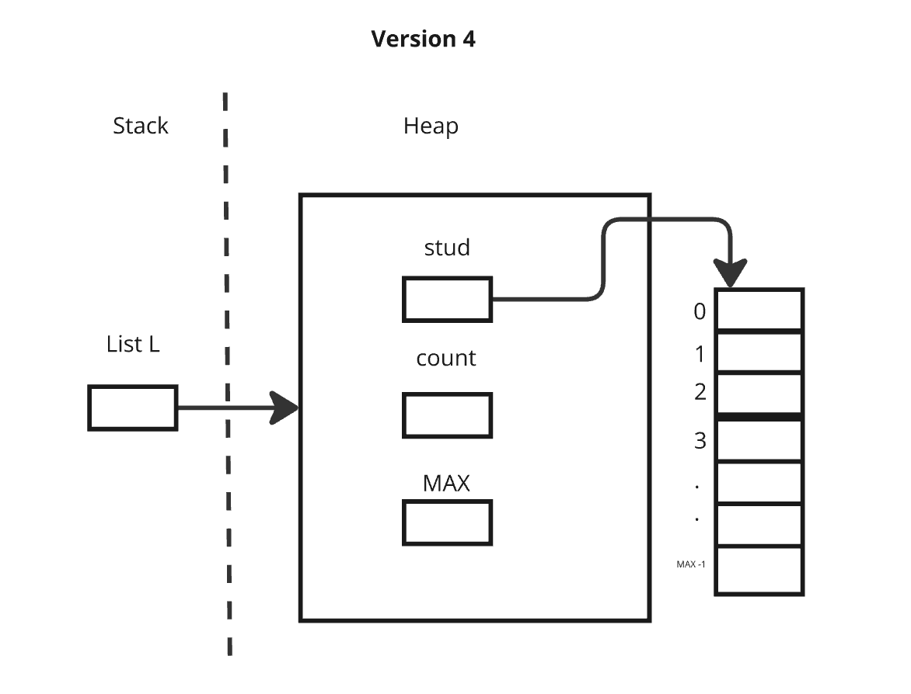

# Variations of Array Implementation of List

## Version One
- List is a structure containing an array and variable count. 

**Challenge:** Try to write the definition of the code based on the provided picture.

## Version Two
- List is a pointer to a structure (a dynamic) containing an array and variable count. 

**Challenge:** Try to write the definition of the code based on the provided picture.

## Version Three
-  List is a structure containing a pointer to the 1st element of a dynamic array, and variable count:

**Challenge:** Try to write the definition of the code based on the provided picture.

## Version Four
-  List is a pointer to a structure containing a pointer to the 1st element of a dynamic array, and variable count:

**Challenge:** Try to write the definition of the code based on the provided picture.
