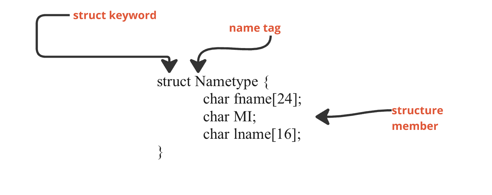

# Structs



### Definition

- A `struct` (short for structure) is a collection of variables of different data types stored together in a single unit. It is similar to a class in object-oriented languages but does not have methods or functions.

### Accessing the Structure

1. **Dot Operator**
   - Access members of a struct using the dot operator: `structVar.structMember`

2. **Array of Structs**
   - Access members of a struct within an array using an index: `ArrayVar[index].structMember`

3. **Pointer to Struct (Arrow Operator)**
   - Access members of a struct through a pointer using the arrow operator: `ptrToStructVar->structMember`
   - Alternatively, you can dereference the pointer and use the dot operator: `(*ptrToStructVar).structMember`

### Declaring and Initializing a Struct Variable

```c
struct MyStruct {
    int class_no; // 4 bytes
    float marks; // 4 bytes 
    char name[20]; // 20 bytes
}; //Total of 28 bytes

struct MyStruct var1;  // Declaration
struct MyStruct var2 = {10, 20.5, "Alniño"};  // Initialization
```

**Challenge: Try to visualize code that I have given to you above (include as well the initialization)**

### <p style = "color:red"> Note: You cannot store the data inside the struct</p>

```c
struct MyStruct {
    int class_no = 10; // 4 bytes
    float marks = 20.5 ; // 4 bytes 
    char name[20] = "Alniño"; // 20 bytes
}; //Total of 28 bytes
```

## Passing Structure to Function 

```c
void displayStruct(struct MyStruct s) {
    printf("%d %f %s\n", s.class_no s.marks, s.name);
}
```

## Array of Structures
```c
struct MyStruct arr[5];  // Declaring an array of structs
```

**Challenge: Try to visualize array of structure based on the code above**

## Pointer to Structure
```c
struct MyStruct s;
struct MyStruct *ptr = &s;
ptr->intValue = 10;  // Accessing using pointer
```
**Challenge: Try to visualize pointer to structure based on the code above**

## TypeDef Structure 

- known as Aliasing Structure
```c
typedef struct { 
    int class_no;
    float marks;
    char name[20];
} MyStructType; //This is now your datatype

MyStructType var;  // Now you can declare without 'struct' keyword
```

## Unions

- Unions are similar to structs but with a key difference: in a union, all members share the same memory location. Only one member can hold a value at a time.


## Enums

- Enumerations (enums) are a way to define a set of named integer constants.
