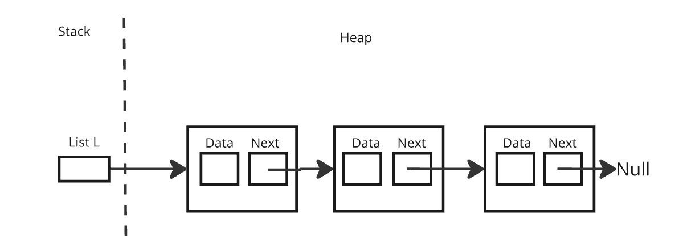

# Linked List

- A linked list is a linear data structure where elements are stored in nodes, and each node points to the next node in the sequence.

- Unlike arrays, linked lists do not store elements in contiguous memory locations; instead, each node contains a pointer/reference to the next node.

## Visualization of Linked List



**Challenge:** Write the definition of the data type list based on the picture provided above. `Data` will be an int and `Next` is struct node pointer.

## Declaring a Variable

```c
List L;
```

## Initialization 

```c
List L = NULL;
```

## Creating and Accessing Linked List 

```c
L = (List)malloc(sizeof(nodetype));
L->data = 2;
L->next = NULL;
```
## Types of Linked List Traversals

1. Pointer to Node (PN) traversal using variable such as q.
- This traversal is used where elements of the linked lists are modified/retrieved.

    - Example: displayList() and selectionSort().
    - Accessing of elements: q -> elem
    - Moving the PN to point the next node:
        q = q->next


2. Pointer to pointer to Node (PPN) traversal using variable such as p.
- This traversal is used when inserting a new element (node) at position other the first.

    - Example: insertLast(), insertPos(), and deleteElem().
    - Accessing of elements: (*p)->elem
    - Moving the PPN to the point to the next pointer: p = &(*p)->link


