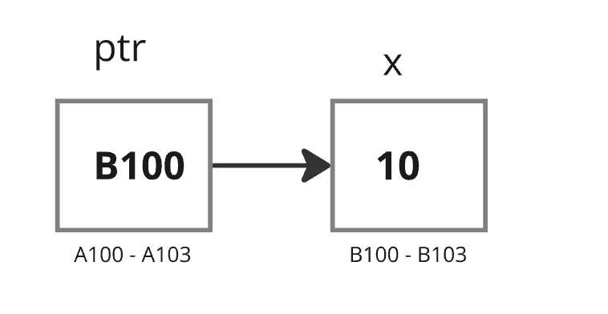
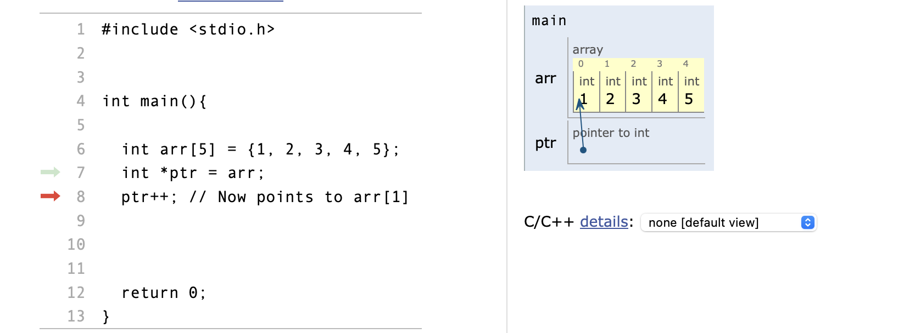
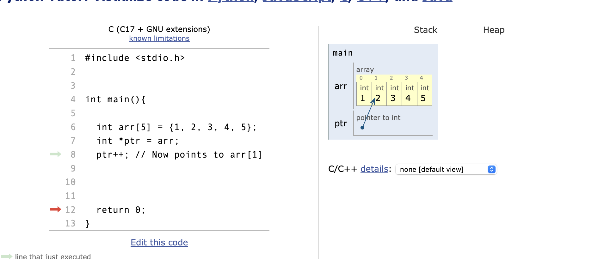

# Pointers in C

- **Definition:** A pointer is a variable that stores the memory address of another variable

#### Declaration:

```c
int *ptr;
```


#### Initialization:

```c
int x = 10;
int *ptr = &x; //ptr gets the address of x 
```




<p align="center">
    ptr gets the address of the x.
</p>

- **Dereferencing:** Accessing the value stored at the address contained in the pointer.

```c
int value = *ptr; // value is now 10
```

 ### NOTE!
 > `*ptr` is considered an alias of x. Thus, accessing the value through `*ptr` is equivalent to accessing the value directly through  `x`.

### Pointer Arithmetic
Pointers can be incremented or decremented to point to the next or previous memory location of the type they point to.

```c
int arr[5] = {1, 2, 3, 4, 5};
int *ptr = arr;
ptr++; // Now points to arr[1] 

// or 

ptr + 1;
```



<p align = "center">
    The name of the variable is a pointer to the first element. The `ptr` copies the address of the `arr` variable.
<p>



<p align = "center">
    Now the points to arr[1].
</p>

### Pointer to Pointer
A pointer that stores the address of another pointer.

```c
int x = 10;
int *ptr = &x;
int **ptr2ptr = &ptr;
```