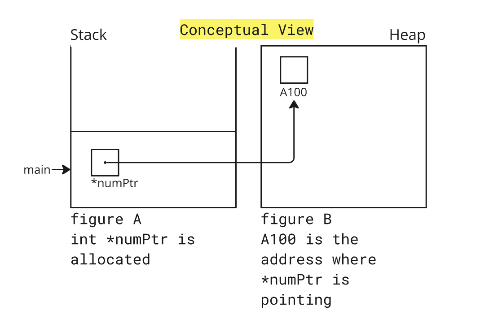

# Dynamic Memory Allocation in C

Before we delve into Dynamic Memory Allocation, Let us talk about execution stack and Heap.

## Execution Stack

- The execution stack is a region of memory that stores temporary variables created by each function. It is a stack data structure that follows the Last In, First Out (LIFO) principle.

## Heap

- The heap is a region of memory used for dynamic memory allocation. Unlike the stack, memory in the heap is managed manually by the programmer. 

- **Dynamic Allocation:** Memory can be allocated and deallocated at any time during program execution using functions like malloc, calloc, realloc, and free.



<p align = "center">
    <i>Conceptual View of Stack and Heap</i>
</p>


Dynamic memory allocation allows programs to obtain memory at runtime using a set of library functions provided by the C standard library. This is useful when the amount of memory needed is not known at compile time. The four primary functions used for dynamic memory allocation are malloc, calloc, realloc, and free.

####  Header File: `stdlib.h`

**1. malloc (Memory Allocation)**

- **Purpose:** Allocates a specified number of bytes of memory and returns a pointer to the allocated memory. The content of the allocated memory is not initialized.

- **Syntax:** `void* malloc(size_t size);`

**Parameters:**
- **size:** Number of bytes to allocate.
Returns: A pointer to the allocated memory, or NULL if the allocation fails.
Example

```c
int *ptr;
ptr = (int*) malloc(10 * sizeof(int)); // Allocates memory for an array of 10 integers
if (ptr == NULL) {
    printf("Memory allocation failed\n");
    exit(1);
}
```


**2. calloc (Memory Allocation with Initialization)**
- **Purpose:** Allocates memory for an array of objects of specified size and initializes all bits of the memory to zero.
- **Syntax:** `void* calloc(size_t num, size_t size);`

**Parameters:**
- **num:** Number of elements.
- **size:** Size of each element in bytes.

**Returns:** A pointer to the allocated memory, or `NULL` if the allocation fails.

```c
int *ptr;
ptr = (int*) calloc(10, sizeof(int)); // Allocates memory for an array of 10 integers and initializes them to zero
if (ptr == NULL) {
    printf("Memory allocation failed\n");
    exit(1);
}
```

3. realloc (Reallocation)**

- **Purpose:** Changes the size of the previously allocated memory block to a new size.
- **Syntax:** `void* realloc(void* ptr, size_t size);`

**Parameters:**
- **ptr:** Pointer to the memory block to be reallocated.
- **size:** New size of the memory block.

**Returns:** A pointer to the reallocated memory, or `NULL` if the reallocation fails

```c
int *ptr;
ptr = (int*) malloc(10 * sizeof(int));
if (ptr == NULL) {
    printf("Memory allocation failed\n");
    exit(1);
}

ptr = (int*) realloc(ptr, 20 * sizeof(int)); // Reallocates memory for an array of 20 integers
if (ptr == NULL) {
    printf("Memory reallocation failed\n");
    exit(1);
}
```

4. **free (Deallocation)**

- **Purpose:** Frees the memory previously allocated by malloc, calloc, or realloc.
- **Syntax:** void free(void* ptr);

Parameters:
- **ptr:** Pointer to the memory block to be freed. If ptr is NULL, no operation is performed.

Returns: Nothing.
```c
int *ptr;
ptr = (int*) malloc(10 * sizeof(int));
if (ptr == NULL) {
    printf("Memory allocation failed\n");
    exit(1);
}

free(ptr); // Frees the allocated memory
ptr = NULL; // Avoids dangling pointer
```

# Important Points
- Always check if the memory allocation functions return NULL to handle allocation failures.
- Use free to release dynamically allocated memory when it's no longer needed to avoid memory leaks.
- After freeing memory, it is good practice to set the pointer to NULL to avoid dangling pointers.
- Improper use of these functions can lead to memory leaks, segmentation faults, and other runtime errors.

By understanding and correctly using dynamic memory allocation functions, you can manage memory efficiently and avoid common pitfalls associated with dynamic memory management in C.