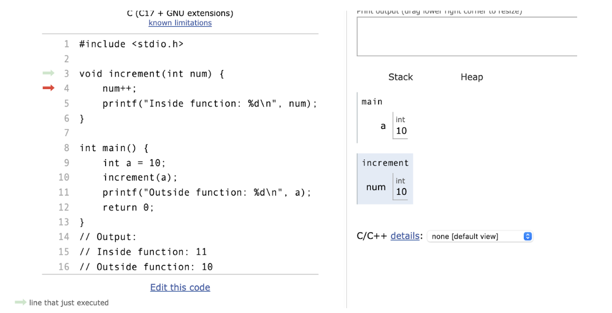
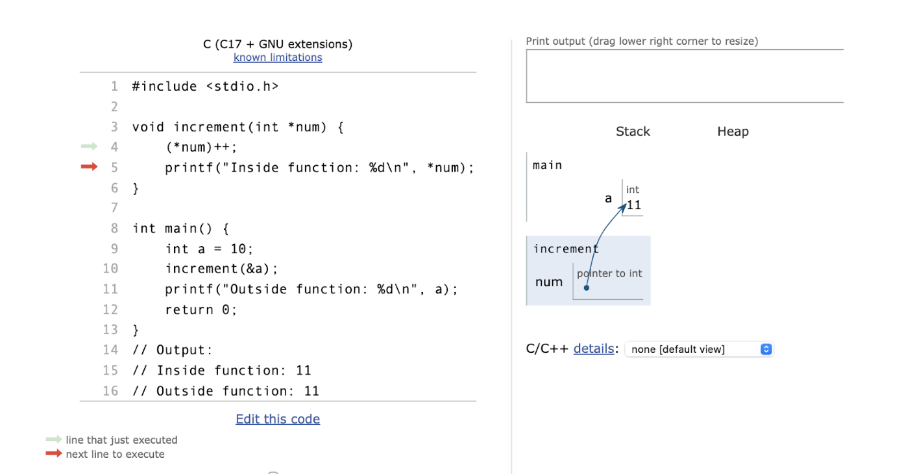

# Functions and Data Types in C Programming

## Function Specification
- **Defines what the function should do.**
- **Defines what the control system should do.**

## Scalar Type
- **Definition**: A type that contains a single value.
- **In C, scalar types are**:
  - Arithmetic types (integers and floating point numbers)
  - Pointers

### Example
```c
int x = 10;
```
In this example, `x` is a scalar type because it contains a single value, which is the integer `10`.


## Aggregate Type

- **Definition**: Holds multiple values in one variable (e.g., arrays, structs).

### Example
```c
//array
int arr[5] = {1, 2, 3, 4, 5};

// struct
struct Person {
  int age;
  char name[20];
}; 
```

In this example, `arr` is an aggregate type because it holds multiple values (the integers `1, 2, 3, 4, 5`) in one variable. Similarly, `struct Person` is an aggregate type because it holds multiple values (the integer `age`, the character array `name`) in one variable.

# Function Parts

### Function Header

- **Characteristics:** 
  - Has no semicolon or curly braces.
  - The function name is followed by the return type and parameters.

###  Example 

```c
int add(int a, int b)
```
In this example, `add` is the function name, `int` is the return type, `a` and `b` are the parameters.

### Function Prototype 

- **Characteristics:** 
  - Provides a declaration of the function.
  - Ends with a semi-colon.

```c
int add(int a, int b);
```
In this example, `add` is the function name, `int` is the return type,  `a` and `b` are the parameters, and the semi-colon indicates the end of the function prototype.

### Function Definition 
- **Characteristics:**
  - Provides the actual code for the function.
  - Starts with the function header and ends with a closing curly brace.

### Example 
```c
int add(int a, int b) {
  return a + b;
}
```
In this example, `add` is the function name, `int` is the return type,
`a` and `b` are the parameters, and the function body is the code inside the
curly braces.

### Function Call
- **Characteristics:**

  - The function call causes the program to execute the statements within the function's body.

### Example
```c
int result = add(5, 7); //catch the return value;

// or

add(5, 7); //if the function doesn't return anything
```
In this example, `add` is the function name, `5` and `7` are
the arguments passed to the function, and `result` is the variable that stores the return value of the function.

## Type Mismatch 

- **Definition**: A type mismatch occurs when a variable or expression of one data type is assigned to or compared with another data type that is incompatible. This can lead to compilation errors or unexpected behavior during program execution.

### Example 1: Assigning a pointer to an integer variable without proper casting.

```c
int *ptr;
int num;
// Incorrect assignment leading to type mismatch
num = ptr; // This will cause a type mismatch error
```
### Example 2: Comparing a float with an integer without proper casting.

```c
int x = 5;
float y = 5.0;
// Comparing different types
if (x == y) {
    // This may lead to unexpected behavior due to type mismatch
}
```

### Example 3: Function expecting an int pointer but receiving an int.
```c
void func(int *ptr);
int num = 10;
// Incorrect function call leading to type mismatch
func(num); // This will cause a type mismatch error
```

# Types of Parameter Passing Techniques in C

In C, there are two primary parameter passing techniques:
1. **Pass by Copy**
2. **Pass by Address (Pass by Reference)**

## Pass by Copy
- **Definition:** A copy of the actual parameter's value is passed to the function. Changes made to the parameter inside the function do not affect the original variable.

- **Characteristics:**
  - The called function works with the copy of the argument's value.
  - Safe from unintended side-effects since the original data is not modified.

```c
#include <stdio.h>

void increment(int num) {
    num++;
    printf("Inside function: %d\n", num);
}

int main() {
    int a = 10;
    increment(a);
    printf("Outside function: %d\n", a);
    return 0;
}
// Output:
// Inside function: 11
// Outside function: 10
```




<p align = "center">
  This shows that it passing the values from the variable a to the function name called <b>increment</b>.
</p>

## Pass by Address (Pass by Reference)

- **Definition:** The address of the actual parameter is passed to the function, allowing direct modification of the original value.

- **Characteristics:**
  - The called function can modify the original variable's value.
  - More efficient for passing large structures or arrays since only the address is copied.
  - Requires the use of pointers to access the original variable.

```c
#include <stdio.h>

void increment(int *num) {
    (*num)++;
    printf("Inside function: %d\n", *num);
}

int main() {
    int a = 10;
    increment(&a);
    printf("Outside function: %d\n", a);
    return 0;
}
// Output:
// Inside function: 11
// Outside function: 11
```


<p align = "center">
This shows that it passing the address of the variable a to the function name called <b>
increment</b>. The function can modify the original variable's value.
</p>


Additional Notes
Return Types: Functions can return various data types including int, float, char, pointers, and even user-defined types like structs.

Function Arguments: Functions can accept any number of arguments, including no arguments at all (void).
Function Overloading: C does not support function overloading, but it can be achieved using function pointers

Function Pointers: C supports function pointers, which are pointers that store the memory address of a function 


